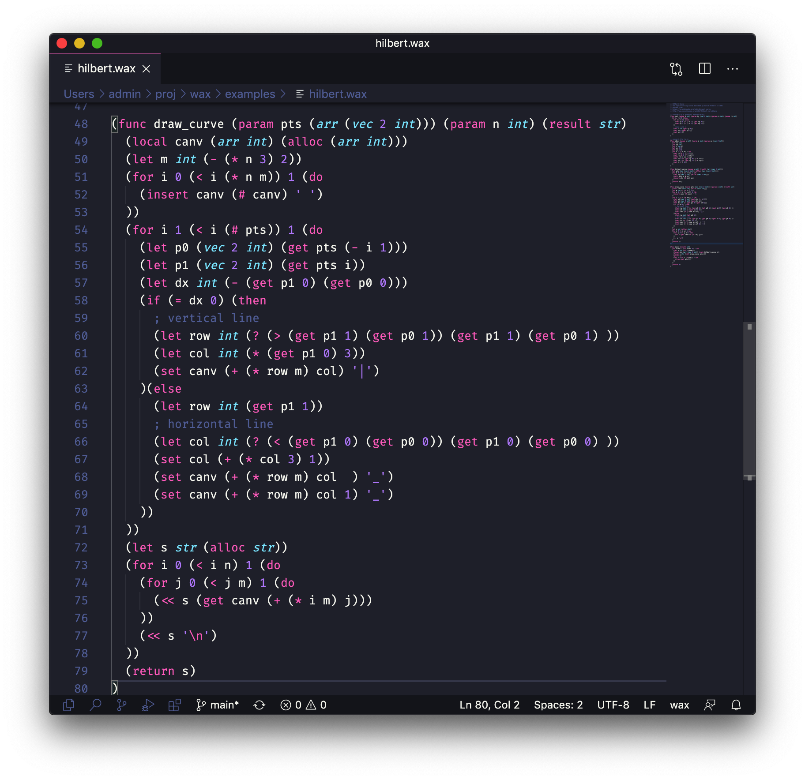

# wax4vscode

A [VS Code](https://code.visualstudio.com/) extension for the [**wax**](https://github.com/LingDong-/wax) programming language. Provides syntax highlighting as well as IDE-like features.

> wax is a tiny language designed to transpile to other languages easily. Currently supported backends: C, C++, Java, TypeScript, Python, C#, Swift, Lua, as well as directly to WebAssembly.

More about [wax here](https://github.com/LingDong-/wax/blob/main/QUICKSTART.md), there's also an [online playground](https://waxc.netlify.app/).

## Features

*The extension assumes that [`waxc`](https://github.com/LingDong-/wax#compiling-the-compiler) is installed in your PATH. If you use the 'run code' feature, the selected target language's compiler/interpreter is also assumed to be installed. e.g. `gcc` for C/C++, or `python` for Python, etc.*

### Syntax highlight for .wax files



### Transpile + Compile + Run in one command

```
⌘⇧P waxc run
```

Supports drawing SVG output directly!


### Transpile to 9 target languages

```
⌘⇧P waxc set target language
```

```
⌘⇧P waxc transpile
```


### Lint on file save

Lint result shown in status bar.


To toggle lint off, use

```
⌘⇧P waxc toggle lint on save
```


### Show Abstract Syntax Tree

```
⌘⇧P waxc print syntax tree
```


## Installation

Clone into `~/.vscode/extensions`